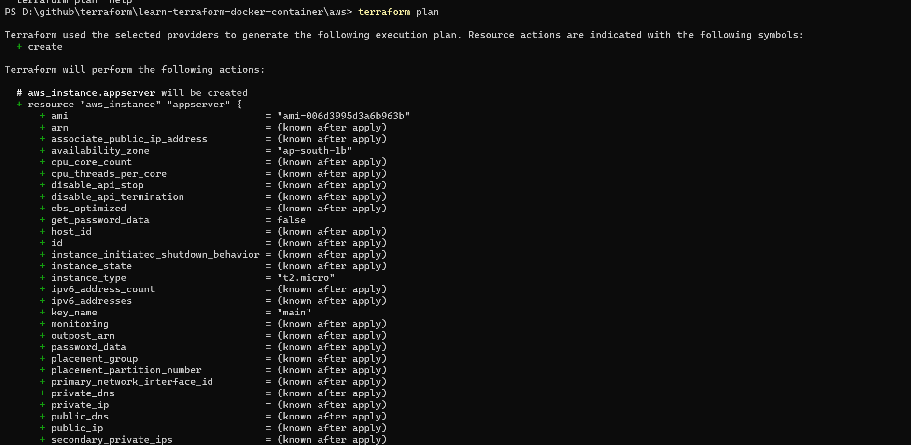
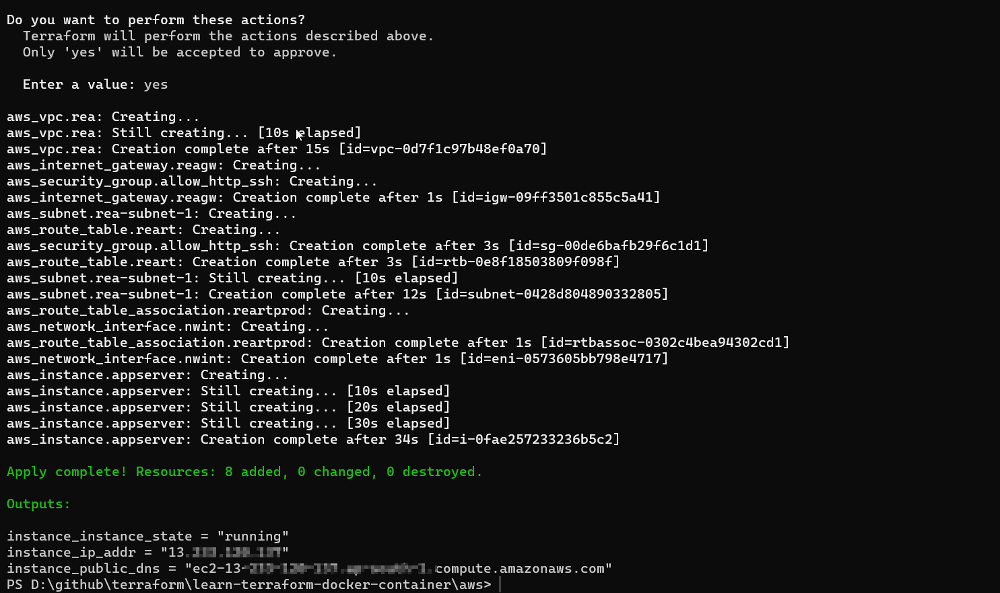
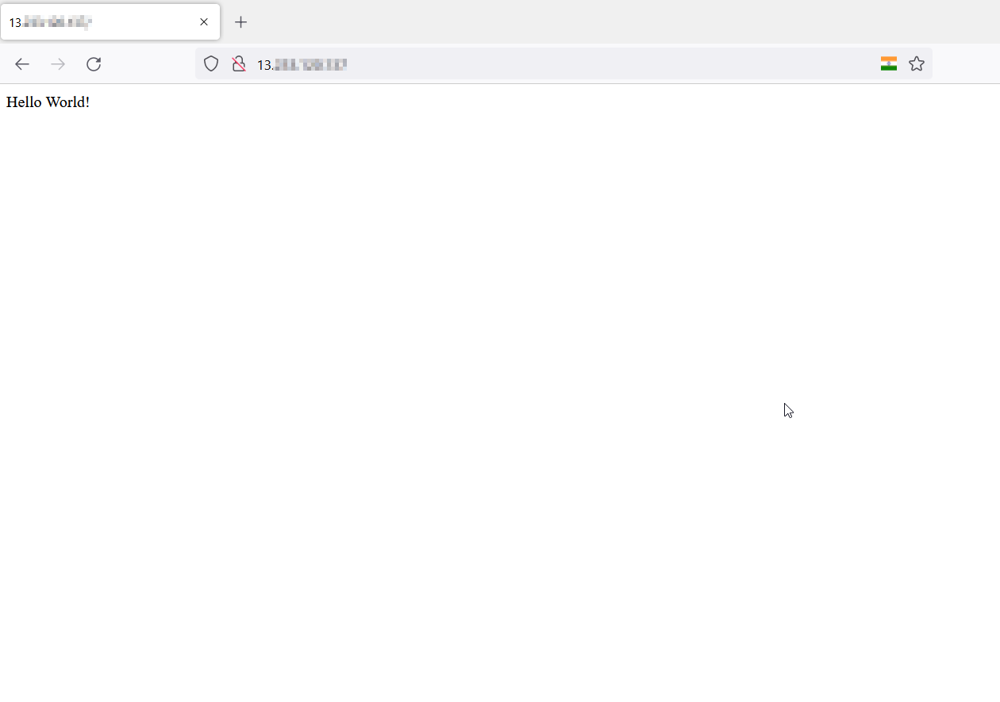

# REA Sinatara App Challenge

The repository is my submission for the challenge [simple-sinatra-app](https://github.com/rea-cruitment/simple-sinatra-app).

For me it is a learning experience as I was able to use terraform (which I have never worked with before, in this solution)

## Goals

- [x] Create the server (can be local VM or AWS based)  
  
  > Deployed an EC2 machine on AWS using Terraform as IAC

- [x] Configure an OS image (your choice) appropriately 
  
  > Deployed Ubuntu 20.04 AMI as OS with Docker as container engine

- [x] Deploy the provided application.
  
  > Dockerized the application that can be deployed on top of container host

- [x] Make the application available on port 80 
  
  > Exposed the application on port 80

- [x] Ensure that the server is locked down and secure.
  
  > Server is isolated from the outside world using custom VPCs, Security Groups and Network ACL's

### (Additional Goals)

- Simplicity
- Code /Documentation and layout
- Ease of deployment
- Idempotency
- Security
- Anti - Fragility

## Documentation

### Assumptions

- As per the requirement goals (1) & (2) the solution will be deployed using IAAS to showcase the IAC understanding, thus no PAAS from AWS is used. However, using PAAS would have been cost effective solution.
- The IAAS is considered as a staging server, rather than a production server (no redundancy, monitoring capabilities etc.)

### Design Choices

- Terraform is used to provision the resources required to use EC2 server.
- The Terraform script can be easily updated by modifying the *variables.tf* file thus seperating the user configuration from the actual code.
- As per the best practices, credentials has to be stored as environment variables.
- Docker is used to package the code, so that it can be easily deployed on to the container host.
- The solution can be extended into a complete CI/CD pipeline using tools such as Github actions, Jenkins or any other tool of choice.

### Prerequisite

- Terraform 
- AWS Cli installed on the client machine (Credentials to be stored in environment variables)
- Text editor
- Network connectivity

### Method of procedure to execute the code

- To deploy the infrastructure , following steps have to be followed
  - Edit the variables.tf file to customize the configuration
  - Make sure you store the AWS credentials in AWS CLI or in the environment variables.
  - Perform a terraform plan & perform terraform apply 
  - Grab a coffee and check the Instance public IP in the browser. 
  
  

#### Variables

**Environment Variables**

- `aws_region` - The default region where the resources will be spun up. (Default region is Mumbai ap-south-1) - Please check [List of regions](https://docs.aws.amazon.com/AWSEC2/latest/UserGuide/using-regions-availability-zones.html) for the complete list.

- `secret_key` - Secret Keys to be loaded from the environment variables - Please check [Access Keys and Secret Keys](https://docs.aws.amazon.com/general/latest/gr/aws-sec-cred-types.html#access-keys-and-secret-access-keys)

- `access_key`  - Access key to be loaded from the environment variables.Please check [Access Keys and Secret Keys](https://docs.aws.amazon.com/general/latest/gr/aws-sec-cred-types.html#access-keys-and-secret-access-keys)

**Application Tags**

I have configured some tags to be used to identify the resources. These can be improved in order to have custom [tags](https://docs.aws.amazon.com/AWSEC2/latest/UserGuide/Using_Tags.html). 

- tag_app_name

- tag_app_iac_version

- tag_app_platform

- tag_app_environment

**Variables**

- availability_zone - The EC2 instance, subnets had to be tied to a specific AZ and thus needs to be configured in a variable - [Regions and Zones](https://docs.aws.amazon.com/AWSEC2/latest/UserGuide/using-regions-availability-zones.html)

- The following IP subnets need to be defined for custom vpc, subnets and route tables - Check [Virtual private clouds](https://docs.aws.amazon.com/AWSEC2/latest/UserGuide/using-vpc.html)  and [Connect to the internet using an internet gateway](https://docs.aws.amazon.com/vpc/latest/userguide/VPC_Internet_Gateway.html)
  
  - vpc_cidr_block - A custom vpc is created by the code - The complete subnet block for the VPC 
  
  - subnet_cidr_block - A subnet associated with the AZ 
  
  - rt_cidr_block_ipv4  - The route table definition for IPv4 addresses
  
  - rt_cidr_block_ipv6  - The route table definition for IPv6 addresses

- The services exposed over the public internet can be restricted by configuring the following variables. If configured with ["0.0.0.0/0"] it will be open to all hosts and networks.
  
  - ssh_client_cidr - Specifiy the IP address or IP Subnet of the addresses that are allowed to access the SSH (Port 22).
  
  - http_client_cidr - Specifiy the IP address or IP Subnet of the addresses that are allowed to access the HTTP (Port 80).
  
  - https_client_cidr - Specifiy the IP address or IP Subnet of the addresses that are allowed to access the HTTPS (Port 443).

- **EC2 Details**
  
  - ec2_instance_type - The type of EC2 instance need to be spin up. [Amazon EC2 Instance Types ](https://aws.amazon.com/ec2/instance-types/)
  
  - ami - The AMI for the host operating system - Default is Ubuntu 20.04.
  
  - ec2_private_ip - The private IP that needs to be configured to the host.
  
  - ssh_key - The key pair that has to be used to login to the ec2 instance.

**Executing the code**

1. *Deploying the infrastructure*
   
   After updating the `variables.tf` use the command `terraform plan` to verify the changes required by the current configuration.
   
   *Example*
   
   

2. Apply the configuration using `terraform apply`
   
   *Example*
   
   

The result would be the IP address that can be used to access the instance.

3. SSH to the node using your favourite ssh_client

4. The instance may take some time to execute the init script, which can be monitored by checking the logs 
   
   `tail -f /var/log/cloud-init-output.log`

5. When the docker container would be up, it is attached to the terminal and logs can be verified in the same file.

6. The application can be verified serving on port 80 by accessing the public_dns or public_ip on the browser, snapshot below.

7. Do not forget to destroy after testing  - `terraform destroy`
   
   ## Scope of Improvements
- The *initial user data* script to configure the EC2 isntance can also be called from a file which can be modified as per the user requirements.

- The solution is not resillient and thus not suitable for production.

- The container host and base images are not scanned for any vulnerabilities.

- The docker image needs to be improved for production.

- The application can be deployed on FAAS/PAAS offerings from AWS such as Lambda functions for economical cost and efficient usage and can provide better resillience.

- The monitoring capabilities needs to be added to monitor and perform preventive and corrective actions for the infrastructure
  
  
